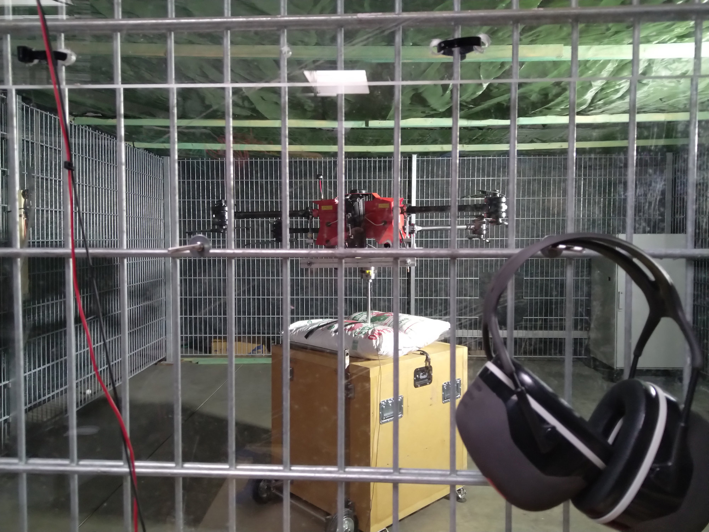
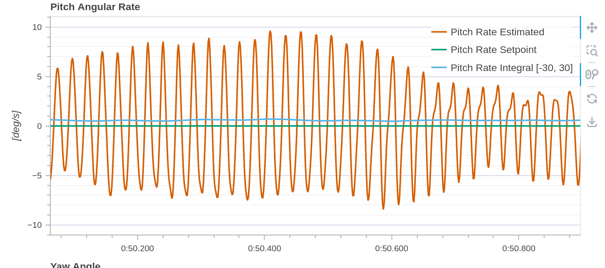
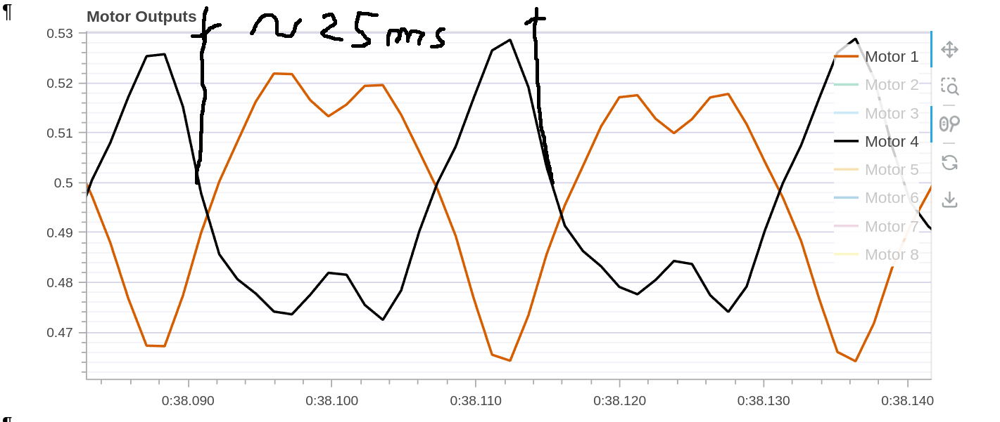
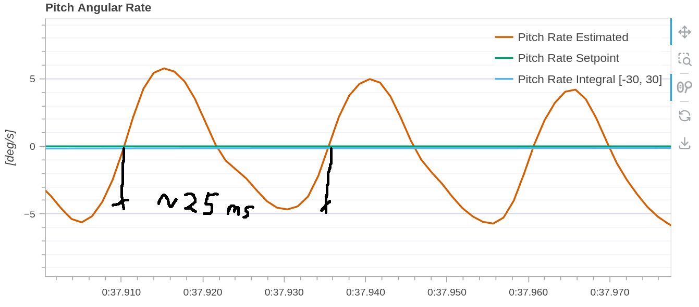
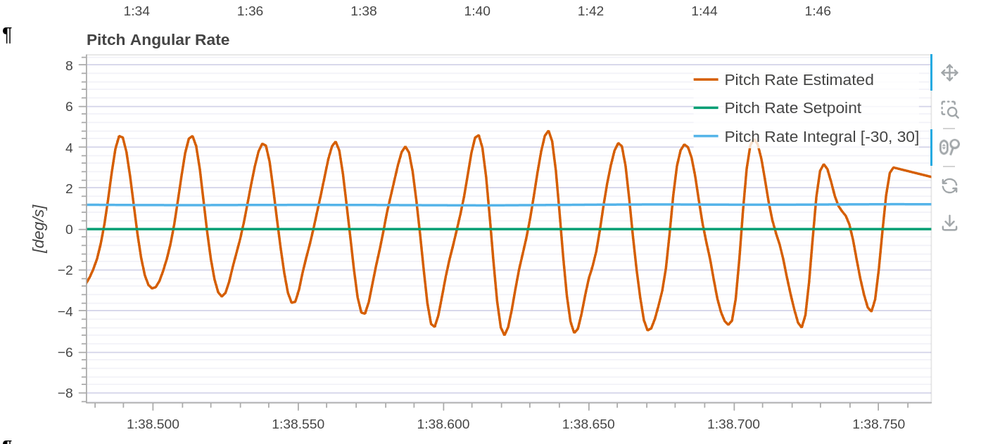
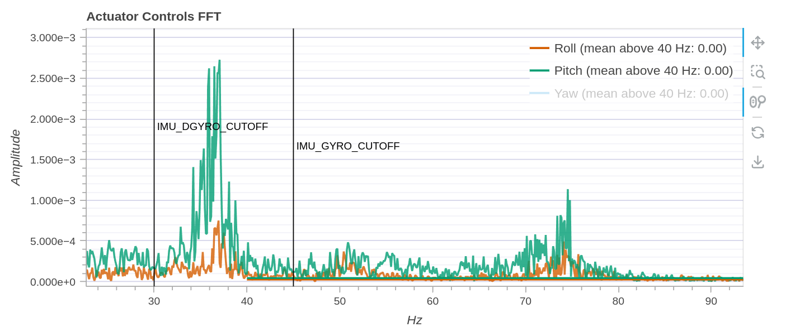
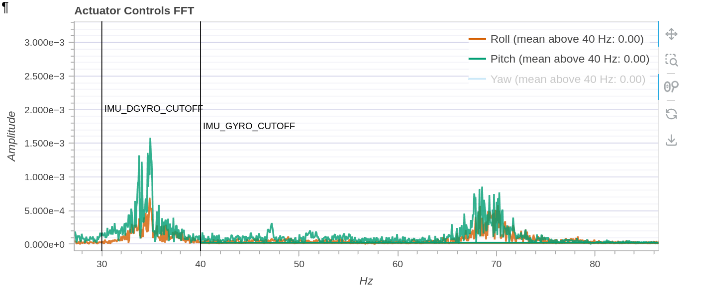

# NXP Auriol 008 Logbook

2024.10.09

 * Create this Github repo and logbook.
 * Update fc firmware to px4 1.15.0 stable release.
Change SDLOG_PROFILE to 784 (high rate, RAW fifo hr gyro, RAW fifo hr accel).
 * Preparing the drone test stand for Auriol008
 * Acro flight mode set

 
  * Create high rate logfile for vibration and gyroscope analysis
 * create three logfiles with 40hz, 36hz, and 45hz imu_gyro_cutoff frequency
 * compare influence on the oscillation of the Pitch Angular Rate
 
 ---
 2024.10.10

 ## 3ea Indoor Teststand

 Problem to solve:
    
Reduce Pitch and Roll Angular Rate oscillations

Iteration One
  * lower mc_pitchrate_i and mc_rollrate_i from 1.0 and 0.8 to 0.5 and 0.5
  * write high rate logfile with filter settings imu_gyro_cutoff 35hz 40hz and 36hz

  * 25ms transit time measured for one period. This results in an oscillation frequency of 40hz
  * When measuring with an oscillation frequency of 36 Hz, the same result with the same amplitude.
  * At 45hz the same oscillation frequency with low amplitude can be observed
  
  Iteration two: increase imu_guro_cutoff to 50hz
  * Increasing it to 50hz had no effect. reset to default 40hz 

  Iteration three: Add notch Filter add 35Hz and 5Hz BW

 Iteration four: Reduce MC_Rollrate_p and MC_Pitchrate_p to 0.180 and 0.20

  * Not controllable on teststand.
  * reset mc_rollrate_d and mc_pitchrate_d to default
  * reset mc_yawrate_p and mc_yawrate_i to default  
  Yaw is sloopy and there are no better results in rollrate oscillations

  Iteration five: Switch back to inital params and only set notch filter and reduce rollrate und pitchrate p

---
2024.10.22

  Pilot: Julian Franz
  Airfield: Farmer Schliephake
  Weather: Temperature 8°C. Wind: Moderate wind speed

Parameter Changes based on rc1 parameters.
 * mc_pitchrate_i lowered from 1.0 to 0.5
 * mc_pitchrate_p lowered from 0.25 to 0.2
 * mc_rollrate_i lowered from 0.9 to 0.5
 * mc_rool_p lowered from 1.5 to 1.0

Test flight carried out with a gentle stick shaker and a log file was written with it.
Log file shared in Discord chat.

---
2024.10.29

  Pilot: Michael Wolkstein
  Airfield: Farmer Schliephake
  Weather: Temperature 10°C. Wind: Light wind

Parameter Changes based on rc1 parameters.
 * mc_pitchrate_p lowered from 0.2 to 0.18

Testflight 1:

A pitch stick shaker can be triggered with these parameters.

Parameter Changes based on rc1 parameters.
 * mc_pitchrate_p lowered from 0.18 to 0.15
 * mc_pitch_p lowered from 1.25 to 1.0

Testflight:

With this parameter, the pitch and roll stick shaker can no longer be triggered.

